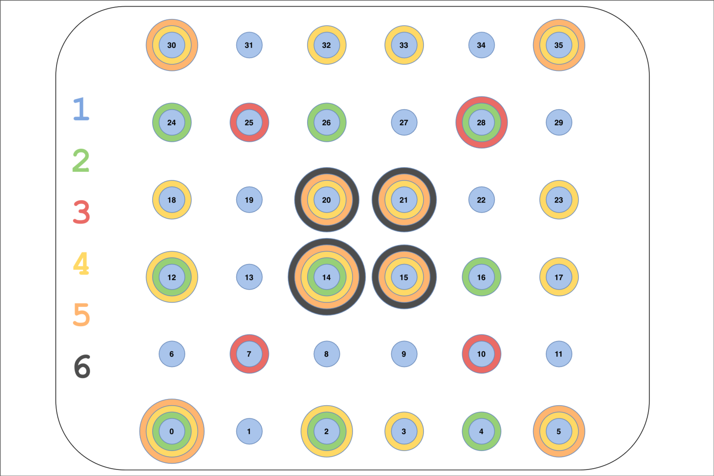

# TinyML Visible Light Positioning (VLP) Hackathon

This starter template contains the challenge data, task description, a baseline VLP notebook, a TensorFlow Lite export path, Raspberry Pi Pico firmware, and a serial evaluation runner.

When LED configurations are mentioned, they refer to the layout and density of the overhead LEDs as given by the following image [1]:


## 0. Quick start

Although it is recommeded to read the full document, the commands to get started with the baseline are:

```sh
# Run all blocks in ./notebooks/baseline_vlp.ipynb

./firmware/build_firmware.sh

python host/run_submission.py \
  --task 1 \
  --split validation \
  --source clean \
  --port /dev/ttyACM0 \
  --uf2 firmware/build/vlp_pico.uf2
```

In order to change the model, you must change both the Jupyter notebook (`./notebooks/baseline_vlp.ipynb`), as well as the export script (`./scripts/export_litert_baseline.py`).

## 1. Data in this package

We have prepared fixed public training and validation splits:

```text
data/train_clean_3x3_1cm.csv
data/validation_clean_3x3_1cm.csv

data/train_raw_3x3_1cm.csv
data/validation_raw_3x3_1cm.csv

data/train_clean_6x6_8cm.csv
data/validation_clean_6x6_8cm.csv
```

The runner does not create new train/validation partitions. `--split train` and `--split validation` load the matching file directly.

The 3x3 CSV files have 11 columns:

```text
x, y,
led_0, led_2, led_4,
led_12, led_14, led_16,
led_24, led_26, led_28
```

The 6x6 CSV files have 38 columns:

```text
x, y, led_0, led_1, ..., led_35
```

- `x` and `y` are ground-truth coordinates in **millimeters**.
- The runner and notebook convert coordinates to centimeters before scoring.
- LED channels follow row-major indexing over the original 6x6 LED grid.
- Raw data retain repeated measurements per coordinate.
- Clean data contain the retained/reconstructed fingerprints.
- The raw training and validation files are split by `(x, y)`, so repeated measurements from one coordinate cannot leak across the public splits.

The official test splits are hidden in:

```text
data/hidden/test_clean_3x3_1cm.csv.aesgcm
data/hidden/test_raw_3x3_1cm.csv.aesgcm
data/hidden/test_clean_6x6_8cm.csv.aesgcm
```

These files are encrypted. We will provide the key for the final test split. During development, use the training and validation files above.

When `--split test` is selected, the runner decrypts the required encrypted CSV in memory and does not create a plaintext test file.

## 2. Metric

The accuracy metric is mean Euclidean positioning error in centimeters:

$$
\frac{1}{M}\sum_{i=1}^{M}
\left\|\hat{\mathbf p}_i-\mathbf p_i\right\|_2.
$$

Lower is better.

The runner also reports median and 95th-percentile error.

## 3. Submission

During the hackathon, call us over when you want your current submission checked. We will run the evaluation runner with your firmware and record the result.

After the hackathon, hand in your source repo. Make sure it contains the code needed to retrain or export your model, rebuild the Pico firmware, and reproduce the version you asked us to check.

## 4. Tasks and weights

### Task 1: *Clean, 1 cm, 3x3 (Configuration 2)* (40%)

Use the clean 3x3, 1 cm dataset. The nine LEDs are:

```text
[0, 2, 4,
 12, 14, 16,
 24, 26, 28]
```

Report:
- mean positioning error in cm; (25%)
- Pico inference latency in ms; (7.5%)
- TFLite model size in bytes. (7.5%)

The goal is to improve positioning error, inference latency, model size, or a combination of these.

### Task 2: *Raw/noisy evaluation, no additional training* (15%)

Reuse the **Task 1 model weights**.

For development, `--source raw` loads the raw 3x3, 1 cm data directly. The raw files contain the same nine Configuration 2 RSS channels as Task 1, so the frozen Task 1 model receives the same feature layout.

You may process, denoise, normalize, aggregate, or calibrate the raw RSS input, but may not retrain the base positioning model on raw data.

Report:
- mean positioning error in cm; (12%)
- Pico inference latency in ms. (3%)

### Task 3: *Sparse 8 cm sampling, full 6x6 LED array* (30%)

Use the clean 6x6 dataset and all 36 RSS channels. The samples are spaced 8 cm apart, so the baseline usually has lower accuracy. Try to improve it while keeping your assumptions reasonable.

You may process, denoise, normalize, aggregate, or calibrate the raw RSS input. The test uses the full 1 cm dataset.

Report:
- mean positioning error in cm; (20%)
- Pico inference latency in ms; (5%)
- TFLite model size in bytes. (5%)

### Task 4: *Session-level LED aging, no additional training* (15%)

Reuse the **Task 1 model weights** and the same nine-LED Configuration 2 input.

The runner loads clean 3x3, 1 cm data, selects the streamed samples, and splits them into contiguous deployment episodes. Each run samples one hidden per-LED exponential decay profile for the installation. Each episode gets one hidden operating age, ordered from youngest to oldest in the stream. All samples in an episode share the same LED brightness state, while the LED decay rates stay fixed across episodes. The runner also adds rare per-sample flicker events and additive noise.

You may implement online calibration or another adaptation strategy that does not retrain the Task 1 model weights.

For development, `--aging-episodes` controls how many deployment episodes are simulated and `--aging-seed` makes the public validation perturbation reproducible. Hidden test seeds and severities may differ.

Report:
- overall mean positioning error in cm; (7.5%)
- per-episode mean, median, and p95 positioning error in cm. (7.5%)

Latency may also be collected for analysis but is not part of the required Task 4 score.

## 5. Python setup

Tested and recommended version: `Python 3.12`

```bash
python -m venv .venv
source .venv/bin/activate
pip install -r requirements.txt
```

## 6. Baseline notebook

Open:

```text
notebooks/baseline_vlp.ipynb
```

The notebook shows a complete Task 1 pipeline with a small baseline model:

1. load `train_clean_3x3_1cm.csv` and `validation_clean_3x3_1cm.csv`;
2. scale RSS values and coordinate targets;
3. train a small two-hidden-layer MLP;
4. report validation error;
5. export the PyTorch model to TFLite using LiteRT Torch;
6. evaluate the TFLite model on validation samples;
7. export the same flatbuffer and scaling constants into the Pico firmware template.

LiteRT conversion runs in a fresh Python process. After retraining, run:

```bash
python scripts/export_litert_baseline.py
```

The included baseline gets about 6 cm mean validation error on the clean public validation data. Your goal is to improve on it.

## 7. Build the Pico firmware

Run:

```bash
./firmware/build_firmware.sh
```

The helper installs or reuses the Pico SDK and Raspberry Pi's Pico TensorFlow Lite Micro port, stages the `firmware/vlp_serial` application, builds it, and copies the UF2 to:

```text
firmware/build/vlp_pico.uf2
```

The template firmware:

- reads a binary request containing float32 RSS values;
- invokes TensorFlow Lite Micro;
- converts outputs to centimeters;
- returns `(x_cm, y_cm, invoke_us)` to the host;
- answers an info command with input feature count, TFLite bytes, and tensor arena bytes.

The template is written for readability. The reported latency only measures model invocation time.

## 8. Evaluation runner

The main evaluation script is:

```text
host/run_submission.py
```

It chooses:

- task: `1`, `2`, `3`, or `4`;
- split: `train`, `validation`, or `test`;
- source: `clean` or `raw` where supported by the task;
- number of streamed samples;
- serial port.

### Public validation example

```bash
python host/run_submission.py \
  --task 1 \
  --split validation \
  --source clean \
  --port /dev/ttyACM0 \
  --uf2 firmware/build/vlp_pico.uf2
```

### Public Task 2 raw validation

```bash
python host/run_submission.py \
  --task 2 \
  --split validation \
  --source raw \
  --port /dev/ttyACM0
```

When `--split test` is selected, the runner decrypts the required encrypted CSV in memory and does not create a plaintext test file.

### Task 2 raw calibration

`host/run_submission.py --calibrate {host,pico,none}` (default `pico`) applies a per-channel gain and clip, fit from `train_raw_3x3_1cm.csv` vs `train_clean_3x3_1cm.csv`, to correct the systematic raw-vs-clean domain shift before the frozen Task 1 model runs:

- `host` — the runner multiplies/clips the features here before sending them.
- `pico` — the runner sends raw features and sets a protocol flag asking the firmware to apply its own baked-in gains (`firmware/vlp_serial/calibration_data.h`).
- `none` — disables the correction.

Regenerate the gains/clip bounds and the firmware header with:

```bash
python scripts/fit_task2_calibration.py
```

`--calibrate` only ever takes effect for `--source raw`; the runner automatically forces it to `none` for clean-source data (e.g. Task 1), since applying it there would distort already-clean readings.

### Task 4 aging calibration

`host/run_submission.py --aging-calibrate {host,pico,none}` (default `pico`) runs an online per-channel automatic-gain-control filter — a running peak tracker (instant attack, slow release) compared against each channel's fresh-installation reference peak — to compensate for the session-level LED brightness decay simulated in Task 4:

- `host` — the runner applies the stateful, stream-order filter here before sending features.
- `pico` — the runner sends raw features and sets a protocol flag asking the firmware to run the same filter on-device (`firmware/vlp_serial/aging_data.h`), with persistent state that resets automatically every time the runner queries device info at the start of a run.
- `none` — disables the correction.

Regenerate the reference peaks/hyperparameters and the firmware header with:

```bash
python scripts/fit_task4_aging_calibration.py
```

`--aging-calibrate` only ever takes effect for `--task 4`; the runner automatically forces it to `none` for every other task, since this filter is *not* a no-op on unaged data (it roughly doubles Task 1's error if applied there).

### Running multiple tasks on one flash

Tasks 1, 2, and 4 all reuse the exact same frozen 9-feature model, so a single firmware flash serves all three — pass `--no-flash` and re-run the evaluator per task without touching BOOTSEL in between:

```bash
python host/run_submission.py --task 1 --split validation --source clean --port /dev/ttyACM0 --uf2 firmware/build/vlp_pico.uf2 --no-flash
python host/run_submission.py --task 2 --split validation --source raw   --port /dev/ttyACM0 --uf2 firmware/build/vlp_pico.uf2 --no-flash --calibrate pico
python host/run_submission.py --task 4 --split validation               --port /dev/ttyACM0 --uf2 firmware/build/vlp_pico.uf2 --no-flash --aging-calibrate pico
```

Task 3 uses a different model architecture (36-channel 6x6 input) and needs its own separate firmware build/flash.

### Evaluation history CSV

Every run appends one row (timestamp, task, split, source, calibration modes, error metrics, timing, model/firmware sizes) to a CSV for comparing runs over time:

```bash
--csv-out eval/eval_history.csv   # default path
--no-csv-out                      # disable logging
```

## References
[1] Zhu, Ran, et al. "Centimeter-level indoor visible light positioning." IEEE Communications Magazine 62.3 (2023): 48-53.